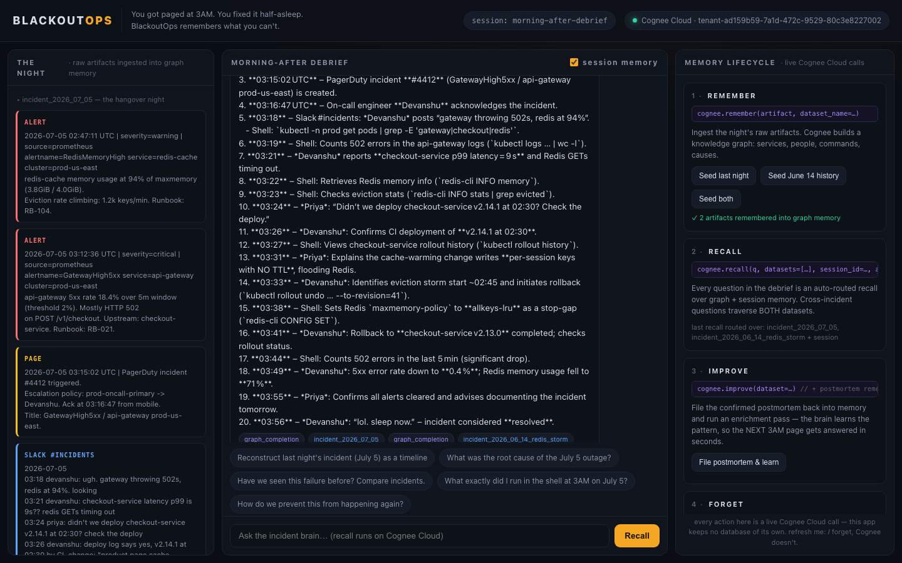

# 🌅 BlackoutOps — the morning-after incident brain

> **You got paged at 3AM. You fixed it half-asleep. BlackoutOps remembers what you can't.**
>
> Built for **"The Hangover Part AI: Where's My Context?"** — WeMakeDevs × Cognee hackathon, July 2026.
> Runs end-to-end on **Cognee Cloud**. The app keeps **no database of its own** — Cognee *is* the memory.



## The problem

Every on-call engineer knows the hangover: alerts at 02:47, pages at 03:15, a blur of `kubectl` commands, a rollback at 03:41, sleep at 04:02. The next morning the dashboard is green and the *context is gone* — what broke, what you ran, why it worked, and whether the team has seen this exact failure before. That knowledge normally dies in scrollback. Six months of incidents later, the org keeps re-diagnosing the same eviction storm from scratch.

**BlackoutOps is The Hangover, played straight for DevOps:** it reconstructs the night you can't remember, answers questions about it, learns the confirmed root-cause pattern, and honors retention policy by provably forgetting.

## What it does

1. **Ingests the night's raw artifacts** — Prometheus alerts, PagerDuty pages, the Slack `#incidents` scroll, your actual shell history, deploy logs — into a Cognee knowledge graph that connects *services → deploys → commands → causes → people*.
2. **Morning-after debrief chat** — "What happened last night?", "What exactly did I run at 3AM?" — every answer is a live, auto-routed `recall()` over graph + session memory.
3. **Cross-incident memory** — "Have we seen this before?" traverses a *separate* incident from three weeks earlier and connects both through shared entities (`redis-cache`, TTL-less keys, eviction storm). This is the question a plain vector store fumbles and a knowledge graph nails.
4. **Files the postmortem back into memory** and runs `improve()` — the confirmed pattern is enriched so the *next* 3AM page gets answered in seconds.
5. **Forgets on command** — retention policy as a first-class feature: `forget(dataset=…)` surgically deletes an incident, and you can watch recall honestly not know it anymore.

## How we use Cognee (the whole lifecycle, not just RAG)

| Lifecycle | Where | What it does here |
|---|---|---|
| **`remember()`** | [`memory.py → ingest_artifacts()`](memory.py) | Each raw ops artifact becomes permanent graph memory in a per-incident dataset (`incident_2026_07_05`, `incident_2026_06_14`) |
| **`remember(session_id=…)`** | [`memory.py → log_to_session()`](memory.py) | Every debrief Q&A is logged to session memory (`morning-after-debrief`) — refresh the page: the *UI* forgets, Cognee doesn't |
| **`recall()`** | [`memory.py → ask()`](memory.py) | Auto-routed recall over **both** incident datasets + session memory (`auto_route=True`), returning graph-completion answers with provenance |
| **`improve()`** | [`memory.py → file_postmortem()`](memory.py) | The human-confirmed postmortem is remembered, then an enrichment pass runs so the recurring pattern ranks first in future recalls |
| **`forget()`** | [`memory.py → purge()`](memory.py) | Dataset-scoped deletion (`memory_only=True`) with Cognee's own receipt shown in the UI — see "Bugs we found upstream" for why memory-only |
| **Graph visualization** | [`memory.py → graph_html()`](memory.py) | The tenant's `/api/v1/visualize` rendered in-app, so you can *see* what the brain built out of the night |

## Architecture

```
┌─────────────────────────────┐        ┌──────────────────────────────────┐
│  war-room UI (static/)      │        │  Cognee Cloud (tenant)           │
│  chat · lifecycle · graph   │  HTTP  │                                  │
│            │                │ ─────► │  remember ─► knowledge graph     │
│  FastAPI (app.py)           │        │  recall   ─► graph + session     │
│  memory layer (memory.py)   │ ◄───── │  improve  ─► pattern enrichment  │
│  · cognee.serve(url, key)   │        │  forget   ─► surgical deletion   │
│  · zero local storage       │        │  visualize─► force graph HTML    │
└─────────────────────────────┘        └──────────────────────────────────┘
```

- **`memory.py`** — the honest core: five functions, each mapping 1:1 to a lifecycle call. No local store, no cache, no cheating.
- **`app.py`** — thin FastAPI: seed / ask / postmortem / forget / graph endpoints + static UI.
- **`dns_fallback.py`** — real-world ops touch: freshly provisioned tenant subdomains can sit in public resolvers' negative DNS cache (ours did, on 1.1.1.1). If the system resolver fails, we resolve over DNS-over-HTTPS and pin via a `socket.getaddrinfo` patch. Diagnosed and worked around *during* the hackathon — very much in the spirit of the theme.

## Quickstart

```bash
git clone <this-repo> && cd blackoutops
python3.12 -m venv .venv && .venv/bin/pip install -r requirements.txt

cat > .env << 'EOF'
COGNEE_BASE_URL="https://tenant-<your-id>.aws.cognee.ai"
COGNEE_API_KEY="<your-key>"
EOF

.venv/bin/uvicorn app:app --port 8787 --loop asyncio
# open http://127.0.0.1:8787
# (--loop asyncio lets the DoH DNS fallback work for brand-new tenants;
#  uvloop bypasses socket.getaddrinfo, plain asyncio doesn't)
```

Get a tenant + key at [platform.cognee.ai](https://platform.cognee.ai) (hackathon credit code `COGNEE-35`).

## Demo script (3 minutes)

1. **Seed the night** → watch `remember()` build two incident datasets on the cloud.
2. Ask **"What happened last night?"** → full timeline reconstruction from fragments.
3. Ask **"What exactly did I run at 3AM?"** → your shell history, in order, with intent.
4. Ask **"Have we seen this failure before?"** → cross-incident graph answer linking June 14's eviction storm — same pattern, different service.
5. **File postmortem & learn** → `improve()` — ask again and watch the confirmed pattern lead the answer.
6. **Open the knowledge graph** → the night, as a graph.
7. **Purge June 14** → `forget()` receipt → ask about it again → the brain honestly doesn't know.

## Bugs we found upstream (and reported)

Building on a live cloud during a hackathon is the best fuzzer there is:

1. **`remember()` into a fully-`forget()`-ed dataset name fails forever** — after `forget(dataset=X)` (full deletion), any later `remember(..., dataset_name=X)` returns `409 RetryError[ProgrammingError]`. Minimal repro in [`scripts/repro_forget_409.py`](scripts/repro_forget_409.py). Our workaround: `forget(memory_only=True)`, which wipes graph/vector memory (recall honestly knows nothing) while keeping the dataset name reusable.
2. **Fresh tenant subdomains can be invisible behind negative DNS caches** — resolvers that were asked about the tenant host *before* provisioning (1.1.1.1 in our case) serve cached NXDOMAIN afterwards. Worked around in [`dns_fallback.py`](dns_fallback.py) via DNS-over-HTTPS + `socket.getaddrinfo` pinning (run uvicorn with `--loop asyncio`; uvloop resolves DNS in C and bypasses the patch).

## AI assistance disclosure

This project was built with **Claude Code (Claude Fable 5)** as a pair programmer for scaffolding, debugging, and documentation, under human direction. Disclosed per hackathon rules.

## Team

Solo build by **Devanshu** ([litelae@gmail.com](mailto:litelae@gmail.com)).

## License

[MIT](LICENSE)
